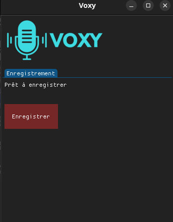
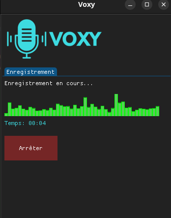
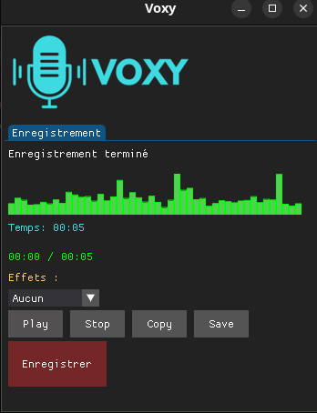

# Voxy

Application de bureau pour enregistrer sa voix, lui appliquer des effets, l'écouter
puis l'exporter.

Projet d'étude réalisé pour apprendre Python (audio, traitement du signal, threads,
interface graphique). Publié tel quel.

## Aperçu

| Accueil | Enregistrement | Lecture + effets |
|---|---|---|
|  |  |  |

## Fonctionnalités

- Enregistrement du micro au format WAV
- Réduction de bruit automatique (passe-haut / passe-bas, noise gate, lissage)
- Visualiseur de niveau en temps réel pendant l'enregistrement
- Lecture avec barre de progression (play / pause / stop)
- Effets de voix : Pitch Aigu, Pitch Grave, Robot, Echo, Rapide, Lent, Chipmunk, Demon
- Copie du fichier audio dans le presse-papiers
- Export dans `~/Documents/Voxy`

## Stack

- Python 3.10+
- [Dear PyGui](https://github.com/hoffstadt/DearPyGui) — interface
- sounddevice — capture micro
- soundfile — lecture / écriture de fichiers audio
- scipy / numpy — filtres et traitement du signal
- librosa — pitch shift, time stretch

## Installation

```bash
python3 -m venv .venv
source .venv/bin/activate
pip install -r requirements.txt
sudo apt install xclip        # copie presse-papiers (Linux)
```

Ou avec le Makefile : `make setup`.

## Lancement

```bash
python main.py
```

Ou : `make run`.

Testé sous Linux / X11 (Ubuntu). Nécessite un micro et un environnement graphique
avec OpenGL.

## Structure

```
main.py            Point d'entrée
config.py          Constantes (audio, thème, chemins)
core/recorder.py   Capture micro + réduction de bruit
gui/app.py         Fenêtre principale
gui/recorder_ui.py Onglet enregistrement
gui/player_ui.py   Lecture, effets, copie, export
```

## Licence

[MIT](LICENSE)
